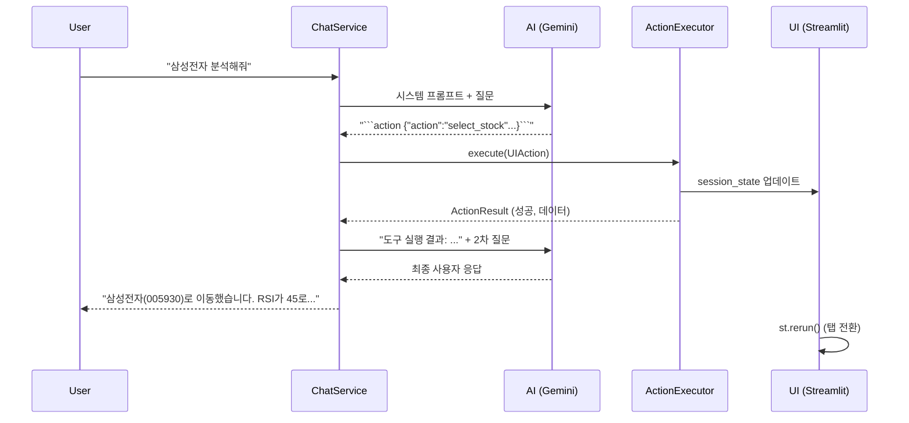

# Phase E: AI Agentic Control - 상세 구현 계획

## 목표
챗봇이 단순히 화면을 **읽는 것(Read)**을 넘어, 사용자 대신 **작업을 수행(Action)**하고 그 **결과를 기반으로 답변**할 수 있도록 합니다.

---

## 지원 액션 목록 (Functions/Tools)

| 액션 ID | 설명 | 파라미터 | 예시 사용자 입력 |
|--------|------|----------|-----------------|
| `switch_tab` | 지정된 탭으로 이동 | `tab_name: str` | "스크리너로 이동해", "실시간 시세 보여줘" |
| `select_stock` | 종목 선택 (분석 탭 이동 포함) | `ticker: str`, `name?: str` | "삼성전자 분석해줘", "005930 보여줘" |
| `run_screener` | AI 스크리너 실행 | `market?: KR/US` | "오늘 추천 종목 뽑아줘" |
| `run_analysis` | 현재 선택된 종목 AI 분석 | - | "이 종목 분석해줘" |
| `search_stock` | 종목명으로 종목코드 검색 | `query: str` | "현대차 종목코드 알려줘" |

---

## Clean Architecture 구조

```
┌───────────────────────────────────────────────────────────┐
│                 Presentation Layer                        │
│  sidebar_chat.py: Action 실행 및 결과 반영                 │
│  app.py: st.session_state.pending_action 감지             │
└────────────────────────┬──────────────────────────────────┘
                         │
┌────────────────────────▼──────────────────────────────────┐
│                 Application Layer                         │
│  ChatService: 응답에서 Action JSON 파싱                    │
│  ActionExecutor: Action 실행 로직 (서비스 호출)            │
└────────────────────────┬──────────────────────────────────┘
                         │
┌────────────────────────▼──────────────────────────────────┐
│                 Domain Layer                              │
│  UIAction: 액션 Value Object                              │
│  ActionResult: 실행 결과 DTO                              │
└───────────────────────────────────────────────────────────┘
```

---

## 변경 및 추가 파일

### Domain Layer

#### [NEW] `src/domain/chat/actions.py`
```python
@dataclass(frozen=True)
class UIAction:
    action_type: str  # switch_tab, select_stock, run_screener, run_analysis, search_stock
    params: Dict[str, Any]

@dataclass
class ActionResult:
    success: bool
    message: str
    data: Optional[Dict[str, Any]] = None  # 검색 결과 등
```

#### [MODIFY] `src/domain/chat/__init__.py`
- `UIAction`, `ActionResult` export 추가

---

### Application Layer

#### [NEW] `src/services/chat/action_executor.py`
AI의 액션을 실제로 수행하는 Application Service입니다.

```python
class ActionExecutor:
    def __init__(self, stock_listing: Dict, screener_service, ...):
        pass
    
    def execute(self, action: UIAction) -> ActionResult:
        if action.action_type == "switch_tab":
            return self._switch_tab(action.params['tab_name'])
        elif action.action_type == "select_stock":
            return self._select_stock(action.params['ticker'])
        # ...
```

#### [MODIFY] `src/services/chat/chat_service.py`
1. 시스템 프롬프트에 **사용 가능한 도구(Tool) 목록** 추가
2. AI 응답 파싱 시 ````action ... ```  블록 감지
3. 액션 실행 후 결과를 포함하여 **2차 응답 생성**

---

### Presentation Layer

#### [MODIFY] `src/dashboard/components/sidebar_chat.py`
1. `ActionExecutor` 인스턴스 생성
2. AI 응답에 `ActionResult` 포함 시 UI 업데이트:
   - `st.session_state.pending_tab` 설정
   - `st.session_state.pending_stock` 설정
   - `st.rerun()` 호출

#### [MODIFY] `src/dashboard/app.py`
1. `st.session_state.pending_tab` 감지 시 자동 탭 전환
2. `st.session_state.pending_stock` 감지 시 자동 종목 선택

---

## 시스템 프롬프트 예시 (ContextAssembler 확장)

```
당신은 다음 도구(Tool)를 사용할 수 있습니다:
- switch_tab(tab_name): 탭 전환 (예: "📊 단일 종목 분석", "🌅 AI 스크리너")
- select_stock(ticker, name): 종목 선택 및 분석 탭 이동
- run_screener(): AI 스크리너 실행
- run_analysis(): 현재 종목 AI 분석 실행

도구를 사용하려면 응답에 다음 형식을 포함하세요:
```action
{"action": "select_stock", "params": {"ticker": "005930", "name": "삼성전자"}}
```

도구 실행 후 결과가 제공되면, 그 결과를 바탕으로 사용자에게 답변하세요.
```

---

## AI 응답 흐름 (2-Pass)



---

## 검증 계획

### 자동화 테스트
1. `_test_action_parsing()`: AI 응답에서 액션 JSON 추출 테스트
2. `_test_action_executor()`: 각 액션 타입 실행 결과 검증

### 수동 검증
| 테스트 케이스 | 입력 | 기대 동작 |
|-------------|------|----------|
| 탭 전환 | "스크리너 탭으로 이동해" | 🌅 AI 스크리너 탭으로 전환 |
| 종목 선택 | "현대차 종목 분석해줘" | 📊 단일 종목 분석 탭 + 현대차(005380) 선택 |
| 스크리너 실행 | "오늘 추천 종목 알려줘" | 스크리너 실행 후 결과 요약 답변 |
| 분석 실행 | "이 종목 분석 결과 보여줘" | AI 분석 실행 후 리포트 요약 |

---

## Feature Planner 검토 및 권장사항

**검토일**: 2025-12-26
**검토 기준**: Clean Architecture, TDD, Phase A/B/C 통합, 보안/에러 처리

### 1. 아키텍처 검토 결과

#### ✅ 강점
- **Clean Architecture 준수**: Domain → Application → Presentation 레이어 분리 명확
- **DIP 준수**: UIAction, ActionResult를 Domain Layer에 배치하여 의존성 역전 구현
- **기존 구현 활용**: UIAction, ActionExecutionResult가 이미 [actions.py](../src/domain/chat/actions.py)에 구현됨
- **2-Pass 패턴**: Action 파싱 → 실행 → 결과 기반 2차 응답 생성 (합리적)

#### ⚠️ 개선 필요 사항

##### 1.1 ActionExecutor의 Layer 위치 모호성
**현재 계획**: Application Layer (`src/services/chat/action_executor.py`)

**문제점**:
- ActionExecutor가 Streamlit의 `st.session_state`를 직접 조작하면 **Presentation Layer 책임을 Application Layer에서 수행**하게 됨
- Clean Architecture 위반: Application Layer는 UI 프레임워크(Streamlit)에 의존하면 안 됨

**권장 해결책**:
```python
# Application Layer: 순수 비즈니스 로직만 수행
class ActionExecutor:
    def execute(self, action: UIAction) -> ActionExecutionResult:
        # 순수 검증 및 데이터 조회만 수행
        if action.action_type == "select_stock":
            ticker = action.params['ticker']
            # 종목 존재 여부 검증 (TickerRepository 사용)
            stock = self.ticker_repo.find_by_ticker(ticker)
            if not stock:
                return ActionExecutionResult(
                    success=False,
                    message=f"종목 {ticker}를 찾을 수 없습니다",
                    action=action
                )
            return ActionExecutionResult(
                success=True,
                message=f"{stock.name}({ticker}) 선택됨",
                action=action,
                redirect_needed=True,
                data={'ticker': ticker, 'name': stock.name}
            )

# Presentation Layer: UI 조작은 여기서만
class ActionHandler:  # sidebar_chat.py에 구현
    def __init__(self, executor: ActionExecutor):
        self.executor = executor

    def handle_action(self, action: UIAction):
        result = self.executor.execute(action)

        if result.success and result.redirect_needed:
            # Streamlit session_state 조작
            if action.action_type == "select_stock":
                st.session_state.ticker_code = result.data['ticker']
                st.session_state.stock_name = result.data['name']
                st.session_state.pending_tab = "📊 단일 종목 분석"
                st.rerun()

        return result
```

##### 1.2 ContextData 확장 필요
**현재**: ContextData는 읽기 전용 스냅샷

**개선안**: Action 실행을 위한 참조 데이터 추가
```python
@dataclass
class ContextData:
    # ... 기존 필드 ...

    # Phase E: Action 실행용 참조 데이터
    available_tabs: List[str] = field(default_factory=list)  # 이동 가능한 탭 목록
    available_tickers: Optional[Dict[str, str]] = None  # {ticker: name} 매핑
    user_id: str = "default_user"  # Phase 20 프로필 연동용
```

##### 1.3 Action 파싱 오류 처리 부재
**현재 계획**: ````action ... ``` 블록 감지만 언급

**개선안**: 명시적인 파싱 오류 처리 및 fallback
```python
class ChatService:
    def send_message(self, user_input: str, context: ContextData) -> str:
        # ... 기존 LLM 호출 ...

        # Action 파싱 시도
        try:
            action = self._parse_action(response_text)
            if action:
                # ActionExecutor 호출 및 2차 응답 생성
                result = self.action_executor.execute(action)

                # 실행 실패 시 사용자에게 명확한 피드백
                if not result.success:
                    return f"{response_text}\n\n⚠️ 작업 실패: {result.message}"

                # 성공 시 2차 LLM 호출
                followup_prompt = self._build_followup_prompt(
                    user_input, action, result, context
                )
                final_response = self.llm_client.generate(followup_prompt)
                return final_response
        except ActionParsingError as e:
            logger.warning(f"Action parsing failed: {e}")
            # 파싱 실패 시 원본 응답 그대로 반환
            return response_text
```

---

### 2. 보안 및 에러 처리

#### 2.1 Action Injection 공격 방지
**위험**: 사용자가 ````action {"action": "delete_all"} ``` 같은 악의적 입력 가능

**방어 전략**:
```python
class ActionExecutor:
    ALLOWED_ACTIONS = {
        'switch_tab', 'select_stock', 'run_screener',
        'run_analysis', 'search_stock'
    }

    def execute(self, action: UIAction) -> ActionExecutionResult:
        # 1. Action 화이트리스트 검증
        if action.action_type not in self.ALLOWED_ACTIONS:
            return ActionExecutionResult(
                success=False,
                message=f"허용되지 않은 작업: {action.action_type}",
                action=action
            )

        # 2. 파라미터 검증 (타입 및 범위)
        if action.action_type == "select_stock":
            ticker = action.params.get('ticker')
            if not ticker or not self._is_valid_ticker(ticker):
                return ActionExecutionResult(
                    success=False,
                    message="유효하지 않은 종목 코드",
                    action=action
                )
```

#### 2.2 Rate Limiting (LLM API 보호)
**문제**: 2-Pass 패턴으로 인해 단일 질문에 2번의 LLM 호출 발생

**개선안**:
```python
class ChatService:
    MAX_CALLS_PER_MINUTE = 20  # Gemini Free Tier: 15 RPM

    def __init__(self, llm_client: ILLMClient):
        self.llm_client = llm_client
        self.call_history: List[datetime] = []

    def _check_rate_limit(self) -> bool:
        now = datetime.now()
        # 1분 이내 호출 기록 필터링
        recent_calls = [t for t in self.call_history if (now - t).seconds < 60]
        self.call_history = recent_calls

        if len(recent_calls) >= self.MAX_CALLS_PER_MINUTE:
            return False

        self.call_history.append(now)
        return True

    def send_message(self, user_input: str, context: ContextData) -> str:
        if not self._check_rate_limit():
            return "⚠️ API 호출 제한 초과. 잠시 후 다시 시도하세요."
```

#### 2.3 Action 실행 타임아웃
**문제**: `run_screener()` 같은 무거운 작업이 LLM 응답 대기 중 실행되면 UX 저하

**개선안**:
```python
class ActionExecutor:
    ACTION_TIMEOUT = {
        'switch_tab': 1,      # 1초
        'select_stock': 2,    # 2초
        'run_screener': 60,   # 1분
        'run_analysis': 30,   # 30초
    }

    def execute(self, action: UIAction) -> ActionExecutionResult:
        timeout = self.ACTION_TIMEOUT.get(action.action_type, 10)

        try:
            with timeout_context(timeout):
                return self._execute_internal(action)
        except TimeoutError:
            return ActionExecutionResult(
                success=False,
                message=f"작업 시간 초과 ({timeout}초)",
                action=action
            )
```

---

### 3. Phase A/B/C 통합 고려사항

#### 3.1 기존 서비스와의 의존성 주입
**ActionExecutor가 필요한 의존성**:
```python
class ActionExecutor:
    def __init__(
        self,
        # Phase A: AI Analysis
        investment_report_service: Optional[InvestmentReportService] = None,

        # Phase B: Signal Generation
        signal_generator_service: Optional[SignalGeneratorService] = None,

        # Phase C: Screener
        screener_service: Optional[ScreenerService] = None,

        # Phase 20: Profile
        profile_repo: Optional[IProfileRepository] = None,

        # Stock Metadata
        ticker_repository: Optional[ITickerRepository] = None,
    ):
        self.report_service = investment_report_service
        self.signal_service = signal_generator_service
        self.screener_service = screener_service
        self.profile_repo = profile_repo
        self.ticker_repo = ticker_repository
```

#### 3.2 Phase 20 통합 (사용자 프로필 기반 개인화)
**기회**: 사용자 투자 성향에 따른 Action 필터링
```python
def execute(self, action: UIAction, user_id: str) -> ActionExecutionResult:
    if action.action_type == "run_screener":
        # 사용자 프로필 로드
        profile = self.profile_repo.load(user_id) if self.profile_repo else None

        # 프로필 기반 market 자동 결정
        market = action.params.get('market')
        if not market and profile:
            # 보수형 → 한국 시장, 공격형 → 미국 시장
            market = 'US' if profile.risk_tolerance.value > 60 else 'KR'

        # Screener 실행
        picks = self.screener_service.run_daily_screen(
            user_id=user_id,
            market=market,
            top_n=5
        )
```

#### 3.3 ContextData → Action 자동 제안
**개선안**: AI가 현재 상황을 보고 적절한 Action 자동 생성
```python
class ContextAssembler:
    def assemble_system_prompt(self, context: ContextData) -> str:
        prompt = "당신은 AI 투자 비서입니다.\n\n"

        # 현재 상황 설명
        prompt += f"**현재 화면**: {context.tab_name}\n"

        if context.tab_name == "📊 단일 종목 분석":
            if context.active_ticker:
                prompt += f"**선택된 종목**: {context.active_stock_name} ({context.active_ticker})\n"
                prompt += "**추천 액션**: run_analysis (AI 분석 실행)\n"
            else:
                prompt += "**종목 미선택 상태**\n"
                prompt += "**추천 액션**: select_stock (종목 선택) 또는 switch_tab (다른 탭 이동)\n"
```

---

### 4. 테스트 전략 (TDD 기반)

#### 4.1 Phase E-1: Domain Layer (UIAction, ActionResult)
**이미 구현됨**: [src/domain/chat/actions.py](../src/domain/chat/actions.py)

**추가 테스트 필요**:
```python
# tests/domain/chat/test_actions.py
class TestUIAction:
    def test_from_dict_valid_action(self):
        # Given
        data = {"action": "select_stock", "params": {"ticker": "005930"}}

        # When
        action = UIAction.from_dict(data)

        # Then
        assert action is not None
        assert action.action_type == "select_stock"
        assert action.params['ticker'] == "005930"

    def test_from_dict_invalid_action_returns_none(self):
        data = {"params": {"ticker": "005930"}}  # action 필드 없음
        action = UIAction.from_dict(data)
        assert action is None
```

#### 4.2 Phase E-2: Application Layer (ActionExecutor)
**TDD Workflow**:
1. **RED**: 각 Action 타입별 실패 테스트 작성
2. **GREEN**: 최소 구현으로 테스트 통과
3. **REFACTOR**: 중복 제거 및 구조 개선

```python
# tests/services/chat/test_action_executor.py
class TestActionExecutor:
    def setup_method(self):
        # Mock 서비스 준비
        self.mock_screener = Mock(spec=ScreenerService)
        self.mock_ticker_repo = Mock(spec=ITickerRepository)

        self.executor = ActionExecutor(
            screener_service=self.mock_screener,
            ticker_repository=self.mock_ticker_repo
        )

    # RED Phase: 실패 테스트 먼저 작성
    def test_execute_invalid_action_type_fails(self):
        action = UIAction("invalid_action", {})
        result = self.executor.execute(action)

        assert result.success is False
        assert "허용되지 않은" in result.message

    def test_execute_select_stock_with_invalid_ticker_fails(self):
        self.mock_ticker_repo.find_by_ticker.return_value = None

        action = UIAction("select_stock", {"ticker": "INVALID"})
        result = self.executor.execute(action)

        assert result.success is False
        assert "찾을 수 없습니다" in result.message

    # GREEN Phase: 성공 케이스 구현
    def test_execute_select_stock_success(self):
        mock_stock = Mock(ticker="005930", name="삼성전자")
        self.mock_ticker_repo.find_by_ticker.return_value = mock_stock

        action = UIAction("select_stock", {"ticker": "005930"})
        result = self.executor.execute(action)

        assert result.success is True
        assert result.redirect_needed is True
        assert result.data['ticker'] == "005930"

    def test_execute_run_screener_success(self):
        mock_picks = [Mock(stock_name="삼성전자", ai_score=85)]
        self.mock_screener.run_daily_screen.return_value = mock_picks

        action = UIAction("run_screener", {"market": "KR"})
        result = self.executor.execute(action, user_id="test_user")

        assert result.success is True
        assert len(result.data['picks']) == 1
```

**Coverage Target**:
- ActionExecutor: ≥90% (핵심 비즈니스 로직)
- Action 파싱 로직: 100% (보안 중요)

#### 4.3 Phase E-3: ChatService Action 통합
**통합 테스트**:
```python
class TestChatServiceWithActions:
    def test_send_message_with_action_triggers_executor(self):
        # Given
        mock_llm = Mock(spec=ILLMClient)
        mock_executor = Mock(spec=ActionExecutor)

        # AI가 action 블록을 포함한 응답 반환
        mock_llm.generate.return_value = """
        네, 삼성전자를 분석하겠습니다.
        ```action
        {"action": "select_stock", "params": {"ticker": "005930"}}
        ```
        """

        service = ChatService(llm_client=mock_llm, action_executor=mock_executor)
        context = ContextData(tab_name="메인")

        # When
        response = service.send_message("삼성전자 분석해줘", context)

        # Then
        assert mock_executor.execute.called
        called_action = mock_executor.execute.call_args[0][0]
        assert called_action.action_type == "select_stock"
```

#### 4.4 Phase E-4: Presentation Layer (UI 통합)
**수동 테스트 체크리스트**:
- [ ] "삼성전자 분석해줘" → 단일 종목 분석 탭 + 005930 선택
- [ ] "스크리너 탭으로 이동해" → 🌅 AI 스크리너 탭 전환
- [ ] "오늘 추천 종목 알려줘" → Screener 실행 + 결과 요약
- [ ] "현재 종목 분석해줘" → AI 분석 실행 + 리포트 표시
- [ ] "존재하지 않는 종목 분석해줘" → 오류 메시지 표시

**E2E 테스트** (Selenium/Playwright):
```python
def test_e2e_select_stock_via_chat(browser):
    # Given: 메인 화면 진입
    browser.goto("http://localhost:8501")

    # When: 챗봇에 종목 분석 요청
    chat_input = browser.find("#sidebar_chat_input")
    chat_input.type("삼성전자 분석해줘")
    chat_input.press("Enter")

    # Then: 탭 전환 및 종목 선택 확인
    wait_for_text("단일 종목 분석")
    assert browser.find("#ticker_code").value == "005930"
```

---

### 5. 구현 우선순위 및 Phase 분할

#### Phase E-1: Domain Layer 완성 (1-2시간)
**목표**: UIAction, ActionResult 엔티티 검증 및 보강

**Tasks** (TDD 순서):
1. **RED**:
   - `test_uiaction_from_dict_with_invalid_json()` 작성
   - `test_action_result_serialization()` 작성
2. **GREEN**:
   - `UIAction.from_dict()` 에러 처리 강화
   - `ActionResult.to_dict()` 구현
3. **REFACTOR**:
   - 타입 힌트 추가 (mypy 검증)
   - Docstring 작성

**Quality Gate**:
- [ ] Domain 테스트 100% 통과
- [ ] 타입 체크 (mypy) 통과
- [ ] ContextData에 `available_tabs`, `user_id` 필드 추가됨

---

#### Phase E-2: ActionExecutor 구현 (3-4시간)
**목표**: Action 실행 비즈니스 로직 (순수 Application Layer)

**Tasks**:
1. **RED**:
   - 각 Action 타입별 실패 케이스 테스트 (invalid params, timeout, 등)
   - Action 화이트리스트 검증 테스트
2. **GREEN**:
   - `execute()` 메인 로직 구현
   - `_execute_select_stock()`, `_execute_run_screener()` 등 private 메서드
3. **REFACTOR**:
   - 중복 검증 로직 추출 → `_validate_params()` 헬퍼
   - 타임아웃 데코레이터 적용

**Dependencies**:
- Phase A/B/C 서비스들 (InvestmentReportService, ScreenerService 등)
- ITickerRepository (종목 검색용 - 신규 구현 필요 시 Mock 사용)

**Quality Gate**:
- [ ] ActionExecutor 테스트 커버리지 ≥90%
- [ ] 모든 Action 타입 (5개) 구현 완료
- [ ] Rate limiting 로직 동작 확인
- [ ] Mock 서비스로 통합 테스트 통과

---

#### Phase E-3: ChatService Action 파싱 통합 (2-3시간)
**목표**: LLM 응답에서 Action 추출 및 2-Pass 구현

**Tasks**:
1. **RED**:
   - `test_parse_action_from_markdown_codeblock()`
   - `test_parse_action_with_malformed_json_returns_none()`
   - `test_send_message_with_action_calls_executor()`
2. **GREEN**:
   - `_parse_action(response: str) -> Optional[UIAction]` 구현
   - `send_message()` 수정: Action 감지 → execute → 2차 LLM 호출
3. **REFACTOR**:
   - Action 파싱 로직 → 별도 `ActionParser` 클래스로 분리

**System Prompt 확장**:
```python
class ContextAssembler:
    def assemble_system_prompt(self, context: ContextData) -> str:
        prompt = super().assemble_system_prompt(context)

        prompt += """

**사용 가능한 도구 (Tools)**:
1. `switch_tab(tab_name)`: 다른 탭으로 이동
   - 예: ```action {"action": "switch_tab", "params": {"tab_name": "🌅 AI 스크리너"}} ```

2. `select_stock(ticker, name)`: 종목 선택 및 분석 탭 이동
   - 예: ```action {"action": "select_stock", "params": {"ticker": "005930", "name": "삼성전자"}} ```

3. `run_screener(market)`: AI 스크리너 실행 (KR 또는 US)
   - 예: ```action {"action": "run_screener", "params": {"market": "KR"}} ```

도구를 사용하려면 응답에 ```action ... ``` 코드 블록을 포함하세요.
실행 결과가 제공되면 그 결과를 바탕으로 사용자에게 자연스럽게 답변하세요.
"""
        return prompt
```

**Quality Gate**:
- [ ] Action 파싱 정확도 100% (테스트 케이스 10개 이상)
- [ ] 2-Pass 플로우 E2E 테스트 통과
- [ ] 파싱 실패 시 graceful fallback 확인

---

#### Phase E-4: Presentation Layer 통합 (2-3시간)
**목표**: sidebar_chat.py와 app.py에서 Action 처리

**Tasks**:
1. **ActionHandler 클래스 구현** (sidebar_chat.py):
   ```python
   class ActionHandler:
       def __init__(self, executor: ActionExecutor):
           self.executor = executor

       def handle(self, result: ActionExecutionResult):
           if result.success and result.redirect_needed:
               if result.action.action_type == "select_stock":
                   st.session_state.ticker_code = result.data['ticker']
                   st.session_state.pending_tab = "📊 단일 종목 분석"
               elif result.action.action_type == "switch_tab":
                   st.session_state.pending_tab = result.data['tab_name']
               st.rerun()
   ```

2. **app.py에서 pending_tab 감지**:
   ```python
   if 'pending_tab' in st.session_state:
       # 탭 인덱스 매핑
       tab_mapping = {
           "📊 단일 종목 분석": 0,
           "🌅 AI 스크리너": 1,
           # ...
       }
       tab_idx = tab_mapping.get(st.session_state.pending_tab, 0)
       del st.session_state.pending_tab
   else:
       tab_idx = 0

   tabs = st.tabs([...])
   selected_tab = tabs[tab_idx]
   ```

**Quality Gate**:
- [ ] 수동 테스트 체크리스트 5개 항목 모두 통과
- [ ] st.rerun() 무한 루프 발생하지 않음 확인
- [ ] 챗봇 응답 시간 ≤5초 (2-Pass 포함)

---

#### Phase E-5: 에러 처리 및 보안 강화 (2시간)
**목표**: Production-ready 안정성 확보

**Tasks**:
1. Rate Limiting 구현 및 테스트
2. Action Injection 방어 테스트
3. LLM API 오류 시 fallback 메시지
4. 타임아웃 처리 테스트

**Quality Gate**:
- [ ] Rate limiting이 20 RPM에서 동작
- [ ] 화이트리스트 외 Action 차단 확인
- [ ] LLM 장애 시 "서비스 일시 중단" 메시지 표시

---

#### Phase E-6: 문서화 및 사용자 가이드 (1시간)
**목표**: 사용자 및 개발자 문서 작성

**Tasks**:
1. README.md에 "AI 비서 사용법" 섹션 추가
2. 예시 질문 10개 작성 (UI에 표시)
3. 개발자 문서: Action 추가하는 방법

---

### 6. 위험 요소 및 완화 전략

| 위험 | 확률 | 영향 | 완화 전략 |
|------|-----|-----|---------|
| **LLM이 Action 형식을 정확히 생성하지 못함** | 중간 | 높음 | System prompt에 Few-Shot 예시 추가, 파싱 실패 시 사용자에게 "다시 시도" 요청 |
| **2-Pass로 인한 응답 시간 지연** | 높음 | 중간 | 1차 응답 후 "작업 수행 중..." 메시지 표시, Action 실행을 백그라운드 작업으로 분리 |
| **st.rerun() 무한 루프** | 낮음 | 높음 | pending_tab 설정 후 즉시 삭제, 리렌더링 카운터로 최대 3회 제한 |
| **Rate Limit 초과 (Gemini Free: 15 RPM)** | 높음 | 중간 | Rate limiting 구현, 유료 플랜 권장 안내 |
| **보안: 악의적 Action 주입** | 낮음 | 높음 | Action 화이트리스트, 파라미터 타입 검증 |

---

### 7. Rollback 전략

각 Phase별 롤백 방법:

- **Phase E-1**: Domain 엔티티만 추가 → 삭제 시 영향 없음
- **Phase E-2**: ActionExecutor 미사용 시 → ChatService에서 executor=None 처리
- **Phase E-3**: Action 파싱 실패 시 → 기존 대화 모드로 fallback
- **Phase E-4**: UI 통합 오류 시 → pending_tab 로직 비활성화 (주석 처리)
- **Phase E-5**: 보안 문제 발생 시 → 전체 Phase E 기능 비활성화 (feature flag)

---

### 8. 최종 권장사항 요약

#### 필수 수정 사항 (P0)
1. **ActionExecutor를 Application Layer에서 순수하게 유지** (Streamlit 의존성 제거)
2. **ActionHandler를 Presentation Layer에 신규 추가** (UI 조작 전담)
3. **Action 파싱 오류 처리 및 fallback 구현**
4. **Rate Limiting 필수 구현** (Gemini Free Tier 보호)
5. **Action 화이트리스트 검증**

#### 권장 개선 사항 (P1)
1. ContextData에 `available_tabs`, `user_id` 필드 추가
2. Phase 20 프로필 기반 Action 개인화
3. System Prompt에 Few-Shot 예시 추가
4. 타임아웃 처리 구현
5. ITickerRepository 인터페이스 신규 정의 (종목 검색용)

#### 선택 사항 (P2)
1. Action 실행을 비동기/백그라운드 작업으로 분리
2. WebSocket 기반 실시간 Action 피드백
3. Action 실행 이력 로깅 및 분석
4. Multi-Action 지원 (하나의 응답에 여러 Action)

---

**검토 완료일**: 2025-12-26
**다음 단계**: 사용자 승인 후 Phase E-1부터 TDD 기반 구현 시작
